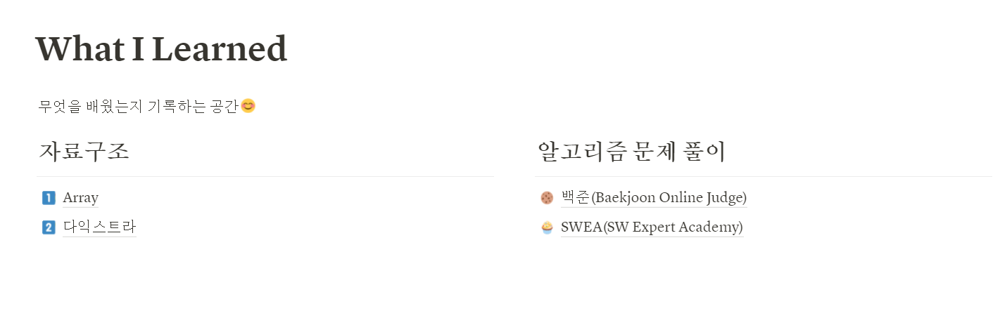
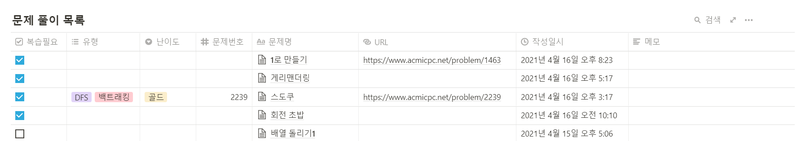

# 알고리즘 문제 풀이

### 1. 풀이 과정이 올라가있는 노션 주소

- https://www.notion.so/What-I-Learned-c916d76e96254ff9bed956e5da368df8

### 2. 보는 방법

- 알고리즘 문제 풀이에서 보고자 하는 풀이가 있는 폴더 (백준, SWEA)를 선택해서 들어간다.

- 해당 폴더에 들어가면 문제 목록이 보여진다. 

- __문제명__을 클릭하면 문제 푼 과정이 보인다.

- 오른쪽 상단에 __검색__을 통해 문제 번호, 문제명 등을 검색하면 해당 문제가 나온다.

  